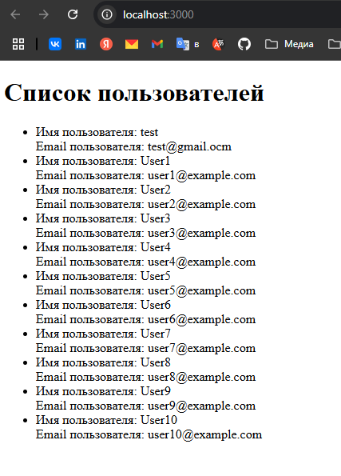
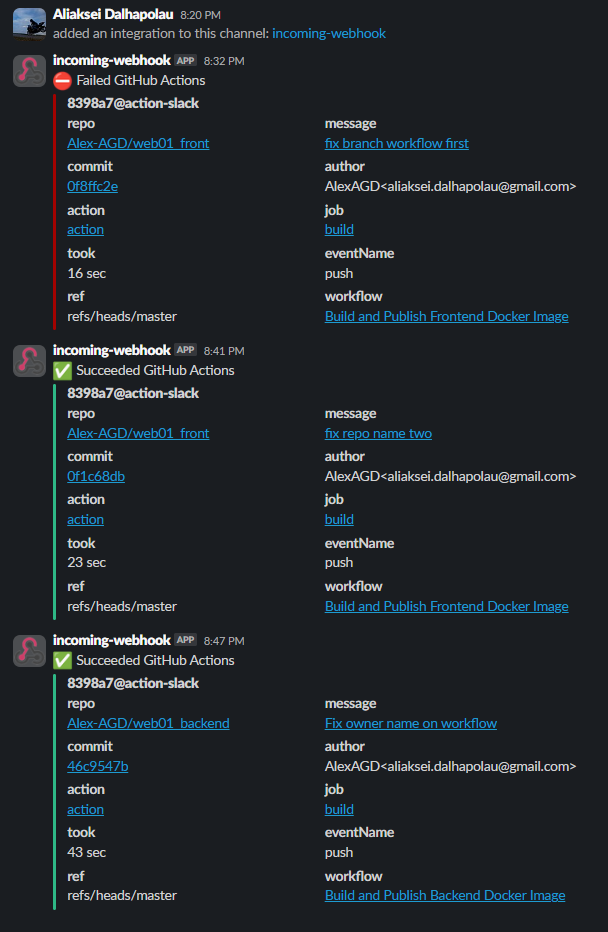

## 08. Docker. Docker compose

### Homework Assignment 1: Docker Compose for Application Stacks

### Dockerfile Frontend

```Dockerfile
FROM node:20.0.0-alpine AS builder
#Stage 1: Build the app
WORKDIR /app
COPY package*.json ./
RUN npm install

COPY . .
ARG build=null
RUN npm run build

#Stage 2: Serve the app
FROM nginx:alpine
ENV ENV=$build
COPY --from=builder /app/dist /usr/share/nginx/html
COPY ./nginx/* /etc/nginx/conf.d/

EXPOSE 80
CMD ["nginx", "-g", "daemon off;"]

```
### DockerFile Backend

```Dockerfile
# Stage 1: Build
FROM openjdk:17-jdk-slim AS builder
ADD . /src
WORKDIR /src
RUN chmod +x ./mvnw && ./mvnw clean package -DskipTests

# Stage 2: Runtime
FROM openjdk:17-jdk-slim

ARG build=dev
ARG commit=null
ARG ver_pom=null
ARG ver_tag=dev

ENV ENV=$build
ENV COMMIT=$commit
ENV VER_POM=$ver_pom
ENV VER_TAG=$ver_tag

COPY --from=builder /src/target/*.jar /app.jar

COPY --from=builder /src/target/classes/*.properties /
EXPOSE 8080

ENTRYPOINT ["sh", "-c", "exec java -jar app.jar --spring.profiles.active=$ENV --server.port=8080"]
```

### Nginx default.conf
```nginx
server {
    listen 80;
    server_name localhost;

    location / {
	index index.html index.htm;
        root /usr/share/nginx/html;
        try_files $uri $uri/ /index.html;
    }

    error_page 500 502 503 504 /50x.html;
    location = /50x.html {
        root /usr/share/nginx/html;
    }

}
```

### Docker-compose.yml

```yaml
services:
  web:
    build:
      context: ./web01
      dockerfile: Dockerfile
      args:
        build: ${ENV}
    env_file:
      - frontend.env
    ports:
      - "3000:80"
    networks:
      - app-network

  backend:
    build:
      context: ./web01_backend
      dockerfile: Dockerfile
      args:
        build: ${ENV}
    env_file:
        - ./backend.env
    ports:
      - "8080:8080"
    networks:
      - app-network
    depends_on:
      - db

  db:
    image: postgres:17.2
    container_name: postgres-container
    environment:
      POSTGRES_USER: admin
      POSTGRES_PASSWORD: admin
      POSTGRES_DB: mydb
    ports:
      - "5432:5432"
    volumes:
      - postgres-data:/var/lib/postgresql/data
      - ./db_schema/init.sql:/docker-entrypoint-init
    networks:
      - app-network

volumes:
  postgres-data:

networks:
  app-network:
```

### History bash

```bash
    1  history
    2  ls
    3  sudo su
    4  cd /media/sf_devOps
    5  ls
    6  cd hometasks/dockerCompose/\
    7  cd hometasks/dockerCompose/
    8  ls
    9  npm create rsbuild@latest
   10  ls
   11  cd web01
   12  ls
   13  sudo mkdir db_schema
   14  cd db_schema
   15  sudo nano init.sql
   16  cd ./
   17  cd ../
   18  sudo nano docker-compose.yml
   19  sudo nano src/config.ts
   20  sudo nano Dockerfile
   21  history
   22  sudo mkdir nginx
   23  sudo nano nginx/default
   24  cd ../
   25  ls
   26  sudo nano .env
   27  ls
   28  docker-compose up --build
   docker compose up -d
   28 [+] Running 3/3
   28 Container dockercompose-web-1      Started                                                                                                                 
   28 Container postgres-container       Started                                                                                                                   
   28 Container dockercompose-backend-1  Started                                                                                                                  
```

### backend.env
```bash
ENV=prod
VER_POM=1.0.0
VER_TAG=v1.0
```

### frontend.env
```bash
REACT_APP_API_URL=http://localhost:8081
ENV=prod
```

### Result




## Homework Assignment 2: Docker build automation (github action)

### GitHub repository Frontend link
[Frontend](https://github.com/Alex-AGD/web01_front.git)

### GitHub repository Backend link
[Backend](https://github.com/Alex-AGD/web01_backend.git)

### github/workflows Frontend
    
```yaml
name: Build and Publish Frontend Docker Image

on:
  push:
    branches:
      - master
  pull_request:
    branches:
      - master

jobs:
  build:
    runs-on: ubuntu-latest

    steps:
      - name: Checkout repository
        uses: actions/checkout@v4

      - name: Set up QEMU
        uses: docker/setup-qemu-action@v3

      - name: Set up Docker Buildx
        uses: docker/setup-buildx-action@v3

      - name: Log in to GitHub Container Registry
        uses: docker/login-action@v3
        with:
          registry: ghcr.io
          username: ${{ github.actor }}
          password: ${{ secrets.CR_TOKEN }}

      - name: Convert owner to lowercase
        run: echo "owner=$(echo ${{ github.repository_owner }} | tr '[:upper:]' '[:lower:]')" >> $GITHUB_ENV

      - name: Build and push Docker image
        uses: docker/build-push-action@v3
        with:
          context: .
          push: true
          tags: ghcr.io/${{ env.owner }}/frontend:latest

      - name: Slack Notification on Success
        if: success()
        uses: 8398a7/action-slack@v3
        with:
          status: success
          fields: repo,message,commit,author,action,eventName,ref,workflow,job,took
        env:
          SLACK_WEBHOOK_URL: ${{ secrets.SLACK_WEBHOOK_URL }}

      - name: Slack Notification on Failure
        if: failure()
        uses: 8398a7/action-slack@v3
        with:
          status: failure
          fields: repo,message,commit,author,action,eventName,ref,workflow,job,took
        env:
          SLACK_WEBHOOK_URL: ${{ secrets.SLACK_WEBHOOK_URL }}
```

### github/workflows Backend

```yaml
name: Build and Publish Backend Docker Image

on:
  push:
    branches:
      - master
  pull_request:
    branches:
      - master

jobs:
  build:
    runs-on: ubuntu-latest

    steps:
      - name: Checkout repository
        uses: actions/checkout@v4

      - name: Set up QEMU
        uses: docker/setup-qemu-action@v3

      - name: Set up Docker Buildx
        uses: docker/setup-buildx-action@v3

      - name: Log in to GitHub Container Registry
        uses: docker/login-action@v3
        with:
          registry: ghcr.io
          username: ${{ github.actor }}
          password: ${{ secrets.CR_TOKEN }}

      - name: Convert owner to lowercase
        run: echo "owner=$(echo ${{ github.repository_owner }} | tr '[:upper:]' '[:lower:]')" >> $GITHUB_ENV

      - name: Build and push Docker image
        uses: docker/build-push-action@v3
        with:
          context: .
          push: true
          tags: ghcr.io/${{ env.owner }}/backend:latest

      - name: Slack Notification on Success
        if: success()
        uses: 8398a7/action-slack@v3
        with:
          status: success
          fields: repo,message,commit,author,action,eventName,ref,workflow,job,took
        env:
          SLACK_WEBHOOK_URL: ${{ secrets.SLACK_WEBHOOK_URL }}

      - name: Slack Notification on Failure
        if: failure()
        uses: 8398a7/action-slack@v3
        with:
          status: failure
          fields: repo,message,commit,author,action,eventName,ref,workflow,job,took
        env:
          SLACK_WEBHOOK_URL: ${{ secrets.SLACK_WEBHOOK_URL }}
```

### Result workflows



